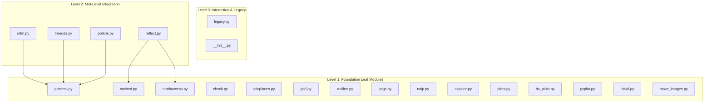

# landmapyr & landmapr Project Memory

## 1. Context & Hybrid Repository Overview (C)

**`landmapyr`** is a hybrid Python/R repository for land mapping, geospatial analysis, and environmental data visualization. Developed alongside the Earth Data Analytics course at CU Boulder's Earth Lab (author: Brian Yandell) and part of the [`byandell-envsys`](https://github.com/byandell-envsys) ecosystem.

- **Dual-Ecosystem Architecture**:
  - **Python Package (`landmapyr/`)**: Active production package (v0.4, 20 modules) providing unified access to satellite reflectance, elevation, soil properties, climate projections, and health/species data.
  - **Planned R Package (`landmapr` in `R/`)**: Idiomatic R companion package bringing native `tidyverse`, `sf`, `terra`, and `stars` support (staged translation based on `notes/transR.md` and `notes/hierarchy.md`).
- **License**: MIT
- **Primary References**: [Root Developer Guide (`DEVELOPER.md`)](file:///Users/brianyandell/Documents/GitHub/landmapyr/DEVELOPER.md), [Planning Record (`guides.md`)](file:///Users/brianyandell/Documents/GitHub/landmapyr/guides.md).

---

## 2. Agent Governance & Coding Rules (R)

### Execution & Safety Boundaries
- **No Automatic Git Commit/Push**: Prepare file edits and verify locally, but **NEVER** execute `git commit` or `git push`. Leave all staging, committing, and pushing for manual user execution.
- **Empirical Verification Required**: Always run concrete verification commands (`pytest`, `ruff`, `mypy`, `devtools::check()`, `quarto render`) before declaring tasks complete.
- **Documentation Integrity**: Maintain existing docstrings, Roxygen blocks, and cross-reference links.

### Python Coding Standards
- **Type Annotations**: Use modern Python type hints (`str | None`, `dict[str, Any]`, `Path`) and explicit return types.
- **Immutable Default Arguments**: Always use `None` guards (`def func(opts: dict | None = None): opts = opts or {}`).
- **Explicit Exception Handling**: Catch specific exceptions (`ValueError`, `FileNotFoundError`, `requests.HTTPError`); avoid bare `except Exception: pass`.
- **Packaging & Caching**: Use `@cached` decorator for expensive network/raster operations; respect `.venv` environment.

### R Coding Standards (for `R/` & `vignettes/`)
- **Assignment**: Always use `<-` for assignment (never `=`).
- **Explicit Namespacing**: Use `pkg::func()` notation in all functions and examples to prevent namespace collisions.
- **Roxygen2 Documentation**: Every exported function in `R/` must have complete `#' @title`, `#' @param`, `#' @return`, and `#' @export` tags.
- **Vector Subsetting Safety**: Filter vectors using `grepl("^\\s*#'", lines)` with `!grepl(...)` or `grep(..., invert = TRUE)`. Never use `!grep(...)`.
- **Vectorized Logic**: Prefer `ifelse()`, `lapply()`, `purrr::map()` over explicit `for` loops.

---

## 3. Repository Architecture & Module Hierarchy (A)

### Directory Layout

```text
landmapyr/
├── DEVELOPER.md                    # Master root architecture & hybrid developer guide
├── README.md                       # Repository overview & quickstart
├── guides.md                       # Blueprint prompts, implementation plan, and walkthrough
├── pyproject.toml                  # Python package configuration & dependencies
├── landmapyr/                      # Active Python package source code (20 modules)
│   └── README.md                   # Python source developer reference
├── R/                              # Planned R package source directory (landmapr)
│   └── README.md                   # Planned R source developer reference & status
├── vignettes/                      # Planned R package vignettes
│   └── DeveloperGuide.qmd          # Master R developer guide vignette
├── docs/                           # Documentation & Quarto Website
│   └── devel/python.md             # Python Developer Guide rendered on site
├── notes/                          # Translation strategy, module hierarchy, and API notes
│   ├── transR.md                   # R translation strategy prompt
│   ├── hierarchy.md                # 3-level module hierarchy map
│   └── transCritic.md              # Critique and refinement of translation rules
├── scripts/                        # Sample workflows & standalone scripts
└── tests/                          # Python pytest suite (test_lookup.py, test_metadata.py)
```

### Python Module Hierarchy (`landmapyr/`)



### Planned R Module Staged Rollout (`R/`)

| Stage | Planned R File | Python Source Module | Key R Dependencies | Status |
| :--- | :--- | :--- | :--- | :--- |
| **Stage 1 (Core)** | `process.R`, `cached.R`, `check.R` | `process.py`, `cached.py`, `check.py` | `terra`, `stars`, `sf`, `memoise`, `readr` | Planned |
| **Stage 2 (Rasters)** | `srtm.R`, `thredds.R`, `polaris.R`, `reflect.R` | `srtm.py`, `thredds.py`, `polaris.py`, `reflect.py` | `terra`, `stars`, `ncdf4`, `httr2` | Planned |
| **Stage 3 (Vectors)** | `gbif.R`, `usgs.R`, `cdcplaces.R`, `redline.R` | `gbif.py`, `usgs.py`, `cdcplaces.py`, `redline.py` | `rgbif`, `dataRetrieval`, `sf`, `dplyr` | Planned |
| **Stage 4 (Plots)** | `plots.R`, `hv_plots.R` | `plots.py`, `hv_plots.py`, `gvplot.py` | `ggplot2`, `ggspatial`, `mapview`, `leaflet` | Planned |

---

## 4. Frameworks, Data Pipelines & Key Dependencies (F)

### Core Dependencies
- **Python**: `geopandas`, `rioxarray`, `xarray`, `earthaccess`, `pygbif`, `dataretrieval`, `pystac-client`, `matplotlib`, `seaborn`, `holoviews`, `geoviews`, `scikit-learn`
- **R (Planned)**: `sf`, `terra`, `stars`, `tidyverse` (`dplyr`, `ggplot2`, `readr`), `rgbif`, `dataRetrieval`, `memoise`, `testthat`

### Common Patterns & Conventions
- **Decorator-Based Caching**: Use `@cached` (`cached.py`) to persist expensive raster slicing, elevation processing, and remote API responses to disk via `pickle`.
- **Automatic CRS Handling**: Reproject spatial layers dynamically to match target bounding geometries (defaulting to EPSG:4326 or native raster CRS).
- **Flexible Kwargs**: Use `**opts` / `**kwargs` propagation across wrappers for plotting and spatial subsetting.
- **Backward Compatibility**: Use `@deprecated` from `legacy.py` when refactoring functions to preserve backward compatibility with student notebooks.

---

## 5. Tooling, Testing & Verification Commands (T)

### Python Verification
```bash
# Linting & Formatting
ruff check landmapyr/ tests/
ruff format --check landmapyr/ tests/

# Type Checking
mypy landmapyr/

# Unit Tests (offline/mocked tests only in CI)
pytest tests/ -v
```

### R Verification (When R Code is Active)
```r
# Load and test R package locally
devtools::load_all()
devtools::document()
devtools::test()
devtools::check()
```

### Documentation & Site Verification
```bash
# Render Quarto documentation and website
quarto render
quarto preview
```
