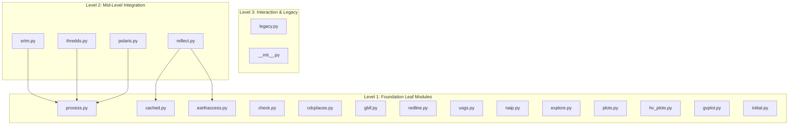

# `landmapyr` Developer Guide

Welcome to the **`landmapyr`** developer documentation. This guide provides an architectural overview, module hierarchy, data routing schemas, testing workflows, and developer guidelines for both the existing **Python package (`landmapyr/`)** and the planned **R package translation (`landmapr` in `R/`)**.

This document is organized according to the **Hybrid R & Python Projects** blueprint in [`Documentation/prompts/devel_guide.md`](https://github.com/byandell/Documentation/blob/main/prompts/devel_guide.md) and follows design patterns established across the [`byandell-envsys`](https://github.com/byandell-envsys) project ecosystem.

---

## 1. Executive Summary & System Architecture

`landmapyr` is a Python package for land mapping, spatial data analysis, and visualization created as a companion to the Earth Data Analytics course at CU Boulder's Earth Lab (author: Brian Yandell) and as a companion/counterpart to the R package `landmapr`.

### Hybrid Architecture Strategy

The repository follows a **dual-ecosystem architecture**:

1. **Python Package (`landmapyr/`)**: The active production package containing 20 modules organized by data source and analytical capability.
2. **Planned R Package (`landmapr` in `R/`)**: A planned idiomatic R translation (outlined in [`notes/transR.md`](file:///Users/brianyandell/Documents/GitHub/landmapyr/notes/transR.md) and [`notes/hierarchy.md`](file:///Users/brianyandell/Documents/GitHub/landmapyr/notes/hierarchy.md)) designed to bring native `tidyverse`, `sf`, `terra`, and `stars` support to the R ecosystem.

```text
landmapyr/
├── DEVELOPER.md                    # Master root architecture & hybrid developer guide
├── README.md                       # Repository overview & quickstart (links to DEVELOPER.md)
├── guides.md                       # Consolidated blueprint prompts, plan, and walkthrough
├── landmapyr/                      # Active Python package source code (20 modules)
│   └── README.md                   # In-source Python developer reference
├── R/                              # Planned R package source directory (landmapr)
│   └── README.md                   # Planned R source developer reference & translation progress
├── vignettes/                      # Planned R package vignettes
│   └── DeveloperGuide.qmd          # Master R developer guide vignette
├── docs/                           # Documentation & Quarto Website
│   └── devel/                      # Detailed technical sub-guides
│       └── python.md               # Extensive Python Developer Guide (rendered on site)
├── notes/                          # Development notes & translation strategy guides
│   ├── transR.md                   # Translation strategy prompt
│   ├── hierarchy.md                # 3-level module hierarchy map
│   └── transCritic.md              # Critique and refinement of translation rules
└── tests/                          # Python pytest suite
```

---

## 2. Python Package Structure (`landmapyr/`)

The Python codebase in `landmapyr/` is designed with a **flat, modular architecture**. Modules are categorized into a **3-level dependency hierarchy**:



### Module Breakdown by Level

#### Level 1: Foundation Modules (No Internal Package Dependencies)
These modules interact directly with external Python libraries (`geopandas`, `rioxarray`, `xarray`, `scikit-learn`, `earthaccess`, `pygbif`, `dataretrieval`) and carry no dependencies on other `landmapyr` modules:

| Module | Core Purpose | Key External Dependencies |
| :--- | :--- | :--- |
| [`cached.py`](file:///Users/brianyandell/Documents/GitHub/landmapyr/landmapyr/cached.py) | Decorator-based disk caching (`pickle`) for long computations | `pickle`, `functools`, `pathlib` |
| [`process.py`](file:///Users/brianyandell/Documents/GitHub/landmapyr/landmapyr/process.py) | Core spatial array operations (clipping rasters by GeoDataFrame bounds, cloud masking, combining arrays) | `rioxarray`, `xarray`, `geopandas`, `rasterio` |
| [`earthaccess.py`](file:///Users/brianyandell/Documents/GitHub/landmapyr/landmapyr/earthaccess.py) | NASA EarthData authentication and granular metadata / link retrieval | `earthaccess`, `geopandas` |
| [`check.py`](file:///Users/brianyandell/Documents/GitHub/landmapyr/landmapyr/check.py) | Data validation utilities for CSV headers and row consistency | `pandas`, `csv` |
| [`cdcplaces.py`](file:///Users/brianyandell/Documents/GitHub/landmapyr/landmapyr/cdcplaces.py) | CDC PLACES health data downloads & Census tract boundary joins | `geopandas`, `pandas` |
| [`gbif.py`](file:///Users/brianyandell/Documents/GitHub/landmapyr/landmapyr/gbif.py) | GBIF species occurrence data query, cleaning, and GeoDataFrame construction | `pygbif`, `geopandas`, `pandas` |
| [`redline.py`](file:///Users/brianyandell/Documents/GitHub/landmapyr/landmapyr/redline.py) | Historical HOLC redlining data acquisition (Mapping Inequality) | `geopandas`, `regionmask` |
| [`usgs.py`](file:///Users/brianyandell/Documents/GitHub/landmapyr/landmapyr/usgs.py) | USGS NWIS water monitoring station data retrieval & flow plotting | `dataretrieval`, `holoviews`, `pandas` |
| [`naip.py`](file:///Users/brianyandell/Documents/GitHub/landmapyr/landmapyr/naip.py) | NAIP aerial imagery STAC search, download, and NDVI calculation | `pystac_client`, `rioxarray`, `xarray` |
| [`explore.py`](file:///Users/brianyandell/Documents/GitHub/landmapyr/landmapyr/explore.py) | Machine learning pipeline wrappers (decision trees, linear regression, clustering) for spatial DataArrays | `scikit-learn`, `xarray`, `numpy` |
| [`plots.py`](file:///Users/brianyandell/Documents/GitHub/landmapyr/landmapyr/plots.py) | Static plotting functions with automatic Cartopy projection and basemap tiles | `matplotlib`, `cartopy`, `contextily`, `seaborn` |
| [`hv_plots.py`](file:///Users/brianyandell/Documents/GitHub/landmapyr/landmapyr/hv_plots.py) | Interactive HoloViews / HVPlot visualizers for raster DataArrays and vector GeoDataFrames | `hvplot`, `holoviews`, `geoviews` |
| [`gvplot.py`](file:///Users/brianyandell/Documents/GitHub/landmapyr/landmapyr/gvplot.py) | GeoViews choropleth map generation and tile overlays | `geoviews`, `cartopy` |
| [`initial.py`](file:///Users/brianyandell/Documents/GitHub/landmapyr/landmapyr/initial.py) | Environment initialization, data directory creation, and robustness settings | `os`, `pathlib` |

#### Level 2: Mid-Level Integration Modules
These modules build upon Level 1 foundation modules to fetch, clip, and process specialized environmental datasets:

| Module | Internal Dependencies | Core Purpose |
| :--- | :--- | :--- |
| [`srtm.py`](file:///Users/brianyandell/Documents/GitHub/landmapyr/landmapyr/srtm.py) | [`process.py`](file:///Users/brianyandell/Documents/GitHub/landmapyr/landmapyr/process.py) | SRTM elevation tile acquisition, clipping (`clip_gdf_da_bounds`), and slope/aspect calculations |
| [`thredds.py`](file:///Users/brianyandell/Documents/GitHub/landmapyr/landmapyr/thredds.py) | [`process.py`](file:///Users/brianyandell/Documents/GitHub/landmapyr/landmapyr/process.py) | MACA climate projection query from THREDDS servers and spatial subsetting |
| [`polaris.py`](file:///Users/brianyandell/Documents/GitHub/landmapyr/landmapyr/polaris.py) | [`process.py`](file:///Users/brianyandell/Documents/GitHub/landmapyr/landmapyr/process.py) | POLARIS 30m soil property tile retrieval (pH, organic matter, clay/sand/silt) and clipping |
| [`reflect.py`](file:///Users/brianyandell/Documents/GitHub/landmapyr/landmapyr/reflect.py) | [`cached.py`](file:///Users/brianyandell/Documents/GitHub/landmapyr/landmapyr/cached.py), [`earthaccess.py`](file:///Users/brianyandell/Documents/GitHub/landmapyr/landmapyr/earthaccess.py) | Harmonized Landsat-Sentinel (HLS) surface reflectance retrieval, cloud masking, and caching |

#### Level 3: Interaction & Compatibility
* [`legacy.py`](file:///Users/brianyandell/Documents/GitHub/landmapyr/landmapyr/legacy.py): Decorator framework (`create_deprecated_alias`) providing backward compatibility and `DeprecationWarning` notifications when function names are updated.
* [`__init__.py`](file:///Users/brianyandell/Documents/GitHub/landmapyr/landmapyr/__init__.py): Package entry point exposing core function aliases and module docstrings.

---

## 3. Planned R Package Translation Strategy (`landmapr`)

As documented in [`notes/transR.md`](file:///Users/brianyandell/Documents/GitHub/landmapyr/notes/transR.md), [`notes/hierarchy.md`](file:///Users/brianyandell/Documents/GitHub/landmapyr/notes/hierarchy.md), and [`notes/transCritic.md`](file:///Users/brianyandell/Documents/GitHub/landmapyr/notes/transCritic.md), an R translation will be developed in the `R/` directory.

### Migration Sequence
Translation will proceed incrementally in 3 stages based on module hierarchy:

1. **Stage 1 (Foundation)**: Translate `process.py` into `R/process.R` first using `terra` and `stars`. This unlocks spatial clipping and array operations required by Level 2 modules. Concurrently translate `cached.py` (using `memoise` or `.rds` caching), `check.py`, `cdcplaces.py`, and `gbif.py`.
2. **Stage 2 (Integration)**: Translate `srtm.py`, `thredds.py`, `polaris.py`, and `reflect.py` once `process.R` and `cached.R` are stable.
3. **Stage 3 (Visualization & ML)**: Translate `plots.py` into `ggplot2` + `ggspatial` helpers, map `explore.py` models to native R `stats` / `caret` / `randomForest`, and convert interactive plots (`hv_plots.py` / `gvplot.py`) to native R `mapview` / `leaflet`.

### Side-by-Side Ecosystem Cross-Reference

| Capability / Domain | Python Implementation (`landmapyr/`) | Target R Implementation (`R/` / `landmapr`) |
| :--- | :--- | :--- |
| **Vector Geometries** | `geopandas.GeoDataFrame` | `sf::st_sf` / `sf::sfc` |
| **Raster Data Cubes** | `xarray.DataArray` / `rioxarray` | `terra::SpatRaster` / `stars::st_stars` |
| **Tabular Data** | `pandas.DataFrame` | `tibble::tibble` / `dplyr::data_frame` |
| **Data Manipulation** | `pandas`, `numpy` | `dplyr`, `purrr`, base R vector math |
| **Static Plotting** | `matplotlib`, `cartopy`, `contextily` | `ggplot2`, `ggspatial`, `maptiles` |
| **Interactive Plotting** | `hvplot`, `holoviews`, `geoviews` | `mapview`, `leaflet` |
| **Species Occurrences** | `pygbif` | `rgbif` |
| **USGS Streamflow** | `dataretrieval` (Python wrapper) | `dataRetrieval` (USGS R package) |
| **Disk Caching** | `pickle` (`cached.py`) | `memoise` / `saveRDS` (`cached.R`) |
| **Documentation Format** | Sphinx / Google docstrings | `Roxygen2` (`#' @export`, `#' @param`) |
| **Unit Testing** | `pytest` (`tests/`) | `testthat` (`tests/testthat/`) |

---

## 4. Development & Testing Workflows

### Python Development Setup

1. **Clone and Install in Editable Mode**:
   ```bash
   git clone https://github.com/byandell-envsys/landmapyr.git
   cd landmapyr
   pip install -e ".[dev]"
   ```

2. **Code Quality Checks**:
   Before submitting pull requests, enforce linting, formatting, and typing:
   ```bash
   ruff check .         # Linting checks
   ruff format .        # Code formatting
   mypy landmapyr/     # Static type checking
   ```

3. **Execute Tests**:
   ```bash
   pytest tests/
   ```
   *Note: Live network/API calls in `tests/` are automatically skipped or mocked during CI runs.*

### Documentation Build Workflow

The repository website is rendered using **Quarto**:

```bash
quarto render           # Render top-level Quarto documents
quarto preview          # Live local preview server
```

### Future R Development Setup (`landmapr`)

When R code is added to `R/`:

```r
# Load package functions during development
devtools::load_all()

# Run R unit tests
devtools::test()

# Generate Roxygen2 documentation and NAMESPACE
devtools::document()

# Build vignettes
devtools::build_vignettes()
```

---

## 5. Backward Compatibility & Deprecation Handling

To preserve compatibility across course notebooks and external user scripts when refactoring function signatures or names, `landmapyr` provides the `create_deprecated_alias` decorator in [`legacy.py`](file:///Users/brianyandell/Documents/GitHub/landmapyr/landmapyr/legacy.py):

```python
from landmapyr.legacy import create_deprecated_alias

def new_function_name(param1, param2):
    """Refactored function implementation."""
    return param1 + param2

# Create deprecated alias with automatic warning
old_function_name = create_deprecated_alias(
    new_function_name, 
    "old_function_name", 
    "new_function_name"
)
```

Calling `old_function_name()` will execute `new_function_name()` while issuing a clear `DeprecationWarning` guiding the developer to update their call site.

---

## 6. Document Navigation & Sub-Guides

- 📄 [Consolidated Planning Record (`guides.md`)](file:///Users/brianyandell/Documents/GitHub/landmapyr/guides.md)
- 🐍 [Python Technical Developer Guide (`docs/devel/python.md`)](file:///Users/brianyandell/Documents/GitHub/landmapyr/docs/devel/python.md)
- 📦 [Python In-Source Package Reference (`landmapyr/README.md`)](file:///Users/brianyandell/Documents/GitHub/landmapyr/landmapyr/README.md)
- 📖 [Planned R Developer Guide Vignette (`vignettes/DeveloperGuide.qmd`)](file:///Users/brianyandell/Documents/GitHub/landmapyr/vignettes/DeveloperGuide.qmd)
- 🛠️ [Planned R In-Source Reference (`R/README.md`)](file:///Users/brianyandell/Documents/GitHub/landmapyr/R/README.md)
- 🏠 [Repository README (`README.md`)](file:///Users/brianyandell/Documents/GitHub/landmapyr/README.md)
