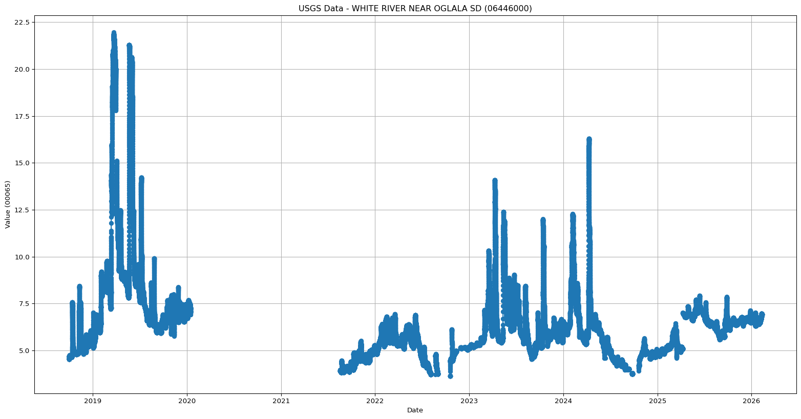

# Working with time-series from the USGS


## Working with time-series from the USGS

In this notebook we’ll walk you through how to access data from the USGS
Water Data initiative. We’ll look at a USGS stream gage that monitors
flows on the White River located near Oglala, SD.

Read more about this USGS stream gage here:
<https://waterdata.usgs.gov/monitoring-location/USGS-06446000/>

``` python
!pip install --quiet geopandas hvplot geoviews dataretrieval
```

``` python
from landmapy.usgs import get_usgs_data, find_usgs_site, get_site_metadata

# Find the site information dynamically
sites = find_usgs_site("White River near Oglala", "SD")

if not sites.empty:
    site_info = sites.iloc[0]
    site_id = site_info['site_no']
    
    # Get available parameters and period of record
    meta = get_site_metadata(site_id)
    
    df_daily = get_usgs_data(
        site_id=site_id,
        site_name=site_info['station_nm'],
        latitude=site_info['dec_lat_va'],
        longitude=site_info['dec_long_va'],
        parameters=meta['parameters'],
        start_date=meta['start_date'],
        end_date=meta['end_date'],
        plot_map=True,
        plot_series=True
    )
    print(df_daily.head())
else:
    print("Site not found.")
```

<script type="esms-options">{"shimMode": true}</script><style>*[data-root-id],
*[data-root-id] > * {
  box-sizing: border-box;
  font-family: var(--jp-ui-font-family);
  font-size: var(--jp-ui-font-size1);
  color: var(--vscode-editor-foreground, var(--jp-ui-font-color1));
}

/* Override VSCode background color */
.cell-output-ipywidget-background:has(
    > .cell-output-ipywidget-background > .lm-Widget > *[data-root-id]
  ),
.cell-output-ipywidget-background:has(> .lm-Widget > *[data-root-id]) {
  background-color: transparent !important;
}
</style>

    Unable to display output for mime type(s): application/javascript, application/vnd.holoviews_load.v0+json

    Unable to display output for mime type(s): application/javascript, application/vnd.holoviews_load.v0+json

<div id='de207f1b-a4b2-4693-9eab-bd5b11135d85'>
  <div id="a165ec4e-bd5e-494c-8f09-737dde4e3234" data-root-id="de207f1b-a4b2-4693-9eab-bd5b11135d85" style="display: contents;"></div>
</div>
<script type="application/javascript">(function(root) {
  var docs_json = {"ab02d546-0a36-47ef-ab07-cd845f0a270a":{"version":"3.5.2","title":"Bokeh Application","roots":[{"type":"object","name":"panel.models.browser.BrowserInfo","id":"de207f1b-a4b2-4693-9eab-bd5b11135d85"},{"type":"object","name":"panel.models.comm_manager.CommManager","id":"19638d48-ca3c-4b2f-99a5-36fda30af53f","attributes":{"plot_id":"de207f1b-a4b2-4693-9eab-bd5b11135d85","comm_id":"66e16ea0fb4246b4b9b547d98cd2a4a2","client_comm_id":"7b6ad1dff6fa42ae91f936572b98ccca"}}],"defs":[{"type":"model","name":"ReactiveHTML1"},{"type":"model","name":"FlexBox1","properties":[{"name":"align_content","kind":"Any","default":"flex-start"},{"name":"align_items","kind":"Any","default":"flex-start"},{"name":"flex_direction","kind":"Any","default":"row"},{"name":"flex_wrap","kind":"Any","default":"wrap"},{"name":"gap","kind":"Any","default":""},{"name":"justify_content","kind":"Any","default":"flex-start"}]},{"type":"model","name":"FloatPanel1","properties":[{"name":"config","kind":"Any","default":{"type":"map"}},{"name":"contained","kind":"Any","default":true},{"name":"position","kind":"Any","default":"right-top"},{"name":"offsetx","kind":"Any","default":null},{"name":"offsety","kind":"Any","default":null},{"name":"theme","kind":"Any","default":"primary"},{"name":"status","kind":"Any","default":"normalized"}]},{"type":"model","name":"GridStack1","properties":[{"name":"mode","kind":"Any","default":"warn"},{"name":"ncols","kind":"Any","default":null},{"name":"nrows","kind":"Any","default":null},{"name":"allow_resize","kind":"Any","default":true},{"name":"allow_drag","kind":"Any","default":true},{"name":"state","kind":"Any","default":[]}]},{"type":"model","name":"drag1","properties":[{"name":"slider_width","kind":"Any","default":5},{"name":"slider_color","kind":"Any","default":"black"},{"name":"value","kind":"Any","default":50}]},{"type":"model","name":"click1","properties":[{"name":"terminal_output","kind":"Any","default":""},{"name":"debug_name","kind":"Any","default":""},{"name":"clears","kind":"Any","default":0}]},{"type":"model","name":"FastWrapper1","properties":[{"name":"object","kind":"Any","default":null},{"name":"style","kind":"Any","default":null}]},{"type":"model","name":"NotificationAreaBase1","properties":[{"name":"js_events","kind":"Any","default":{"type":"map"}},{"name":"position","kind":"Any","default":"bottom-right"},{"name":"_clear","kind":"Any","default":0}]},{"type":"model","name":"NotificationArea1","properties":[{"name":"js_events","kind":"Any","default":{"type":"map"}},{"name":"notifications","kind":"Any","default":[]},{"name":"position","kind":"Any","default":"bottom-right"},{"name":"_clear","kind":"Any","default":0},{"name":"types","kind":"Any","default":[{"type":"map","entries":[["type","warning"],["background","#ffc107"],["icon",{"type":"map","entries":[["className","fas fa-exclamation-triangle"],["tagName","i"],["color","white"]]}]]},{"type":"map","entries":[["type","info"],["background","#007bff"],["icon",{"type":"map","entries":[["className","fas fa-info-circle"],["tagName","i"],["color","white"]]}]]}]}]},{"type":"model","name":"Notification","properties":[{"name":"background","kind":"Any","default":null},{"name":"duration","kind":"Any","default":3000},{"name":"icon","kind":"Any","default":null},{"name":"message","kind":"Any","default":""},{"name":"notification_type","kind":"Any","default":null},{"name":"_destroyed","kind":"Any","default":false}]},{"type":"model","name":"TemplateActions1","properties":[{"name":"open_modal","kind":"Any","default":0},{"name":"close_modal","kind":"Any","default":0}]},{"type":"model","name":"BootstrapTemplateActions1","properties":[{"name":"open_modal","kind":"Any","default":0},{"name":"close_modal","kind":"Any","default":0}]},{"type":"model","name":"TemplateEditor1","properties":[{"name":"layout","kind":"Any","default":[]}]},{"type":"model","name":"MaterialTemplateActions1","properties":[{"name":"open_modal","kind":"Any","default":0},{"name":"close_modal","kind":"Any","default":0}]},{"type":"model","name":"ReactiveESM1","properties":[{"name":"esm_constants","kind":"Any","default":{"type":"map"}}]},{"type":"model","name":"JSComponent1","properties":[{"name":"esm_constants","kind":"Any","default":{"type":"map"}}]},{"type":"model","name":"ReactComponent1","properties":[{"name":"esm_constants","kind":"Any","default":{"type":"map"}}]},{"type":"model","name":"AnyWidgetComponent1","properties":[{"name":"esm_constants","kind":"Any","default":{"type":"map"}}]},{"type":"model","name":"request_value1","properties":[{"name":"fill","kind":"Any","default":"none"},{"name":"_synced","kind":"Any","default":null},{"name":"_request_sync","kind":"Any","default":0}]}]}};
  var render_items = [{"docid":"ab02d546-0a36-47ef-ab07-cd845f0a270a","roots":{"de207f1b-a4b2-4693-9eab-bd5b11135d85":"a165ec4e-bd5e-494c-8f09-737dde4e3234"},"root_ids":["de207f1b-a4b2-4693-9eab-bd5b11135d85"]}];
  var docs = Object.values(docs_json)
  if (!docs) {
    return
  }
  const py_version = docs[0].version.replace('rc', '-rc.').replace('.dev', '-dev.')
  async function embed_document(root) {
    var Bokeh = get_bokeh(root)
    await Bokeh.embed.embed_items_notebook(docs_json, render_items);
    for (const render_item of render_items) {
      for (const root_id of render_item.root_ids) {
    const id_el = document.getElementById(root_id)
    if (id_el.children.length && id_el.children[0].hasAttribute('data-root-id')) {
      const root_el = id_el.children[0]
      root_el.id = root_el.id + '-rendered'
      for (const child of root_el.children) {
            // Ensure JupyterLab does not capture keyboard shortcuts
            // see: https://jupyterlab.readthedocs.io/en/4.1.x/extension/notebook.html#keyboard-interaction-model
        child.setAttribute('data-lm-suppress-shortcuts', 'true')
      }
    }
      }
    }
  }
  function get_bokeh(root) {
    if (root.Bokeh === undefined) {
      return null
    } else if (root.Bokeh.version !== py_version) {
      if (root.Bokeh.versions === undefined || !root.Bokeh.versions.has(py_version)) {
    return null
      }
      return root.Bokeh.versions.get(py_version);
    } else if (root.Bokeh.version === py_version) {
      return root.Bokeh
    }
    return null
  }
  function is_loaded(root) {
    var Bokeh = get_bokeh(root)
    return (Bokeh != null && Bokeh.Panel !== undefined)
  }
  if (is_loaded(root)) {
    embed_document(root);
  } else {
    var attempts = 0;
    var timer = setInterval(function(root) {
      if (is_loaded(root)) {
        clearInterval(timer);
        embed_document(root);
      } else if (document.readyState == "complete") {
        attempts++;
        if (attempts > 200) {
          clearInterval(timer);
      var Bokeh = get_bokeh(root)
      if (Bokeh == null || Bokeh.Panel == null) {
            console.warn("Panel: ERROR: Unable to run Panel code because Bokeh or Panel library is missing");
      } else {
        console.warn("Panel: WARNING: Attempting to render but not all required libraries could be resolved.")
        embed_document(root)
      }
        }
      }
    }, 25, root)
  }
})(window);</script>

    /users/brianyandell/miniconda3/envs/earth-analytics-python/lib/python3.11/site-packages/dataretrieval/nwis.py:692: UserWarning: WARNING: Starting in March 2024, the NWIS qw data endpoint is retiring and no longer receives updates. For more information, refer to https://waterdata.usgs.gov.nwis/qwdata and https://doi-usgs.github.io/dataRetrieval/articles/Status.html or email CompTools@usgs.gov.
      warnings.warn(
    /users/brianyandell/miniconda3/envs/earth-analytics-python/lib/python3.11/site-packages/dask/dataframe/__init__.py:49: FutureWarning: 
    Dask dataframe query planning is disabled because dask-expr is not installed.

    You can install it with `pip install dask[dataframe]` or `conda install dask`.
    This will raise in a future version.

      warnings.warn(msg, FutureWarning)



    datetime
    1990-10-01 00:00:00+00:00    2.177465
    1990-10-02 00:00:00+00:00    2.043750
    1990-10-03 00:00:00+00:00    1.272917
    1990-10-04 00:00:00+00:00    0.696979
    1990-10-05 00:00:00+00:00    0.498646
    Freq: D, Name: 00060, dtype: float64

# Now it is your turn

Think of a heavy rainfall, flood, drought, or other hydrologic event
that you would like to tell a story about using data. When did the event
take place? Where did it happen?

Select a USGS gaging station that will help you tell this data story.

USGS NWIS Mapper: <https://maps.waterdata.usgs.gov/mapper/index.html>

Once you have the unique site number and lat/lon, you can either:

-   Modify the code above that we used to look at the White River
-   Copy and paste the code from above, and then modify

Add new code cells by with the `+ Code` button on the ribbon at the top
of this notebook.

# Answer the following questions.

# (**You can make edits to this text box by double clicking**)

Site number:

Site location:

Hydrologic event of interest:

Why did you select this location/event?
