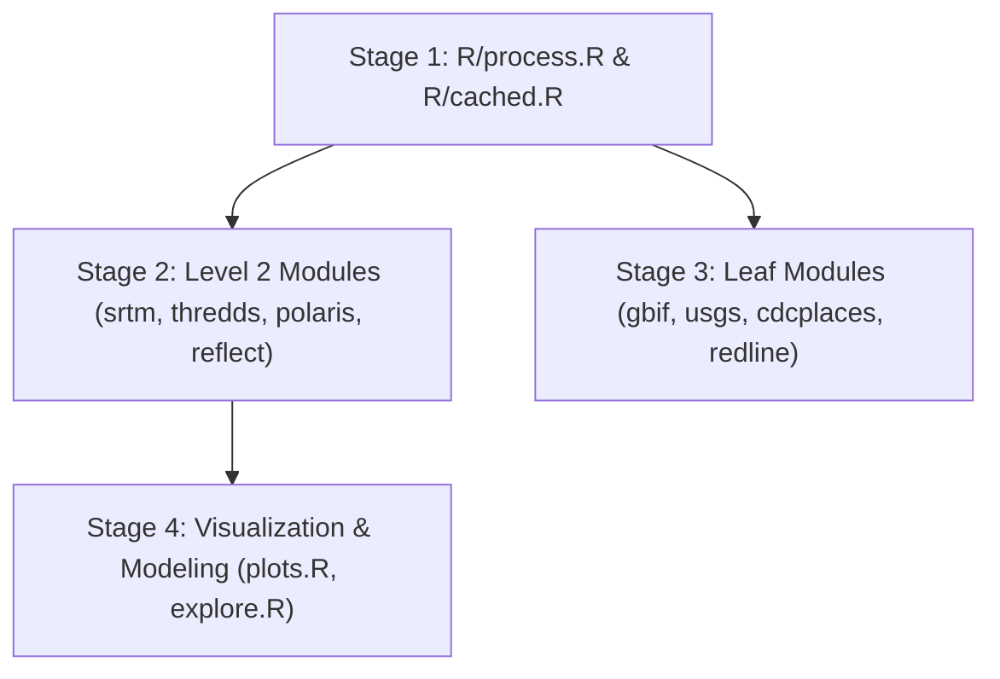

# Developer Guide: R Package Translation (`landmapr`)

This document serves as the master R developer guide for the planned R translation of `landmapyr` into the R package **`landmapr`** (to be housed in `R/`).

> [!NOTE]
> **Translation Status**:
> No R source code is currently in this repository. This guide establishes the architectural standards, package layout, R spatial dependency mappings, and step-by-step module translation sequence for when R code is written.

---

## 1. R Package Architecture & Target Layout

The R package will follow standard R package conventions and `pkgdown` vignette structure:

```text
landmapr/
├── DESCRIPTION                     # Package dependencies (Imports & Suggests)
├── NAMESPACE                       # Auto-generated by roxygen2
├── R/                              # R package source functions
│   ├── README.md                   # In-source developer reference
│   ├── process.R                   # Foundation raster/vector operations (terra & sf)
│   ├── srtm.R                      # SRTM elevation & slope analysis
│   ├── thredds.R                   # MACA climate projections
│   ├── polaris.R                   # POLARIS soil data
│   ├── reflect.R                   # Landsat/Sentinel surface reflectance
│   ├── cdcplaces.R                 # Health & census data
│   ├── gbif.R                      # GBIF species occurrences (rgbif)
│   ├── usgs.R                      # USGS streamflow (dataRetrieval)
│   ├── plots.R                     # Static map helpers (ggplot2 & ggspatial)
│   ├── hv_plots.R                  # Interactive spatial mapping (mapview & leaflet)
│   └── cached.R                    # Disk caching (memoise / saveRDS)
├── vignettes/                      # R Package Vignettes
│   └── DeveloperGuide.qmd          # Master R developer guide
└── tests/
    └── testthat/                   # Unit test suite (testthat)
        └── test-process.R
```

---

## 2. R Spatial Package Dependency Mappings

Following the translation strategy in [`notes/transR.md`](file:///Users/brianyandell/Documents/GitHub/landmapyr/notes/transR.md) and refinements in [`notes/transCritic.md`](file:///Users/brianyandell/Documents/GitHub/landmapyr/notes/transCritic.md), the Python spatial stack maps to R packages as follows:

| Python Package / Feature | R Target Package | R Translation Rationale |
| :--- | :--- | :--- |
| `geopandas.GeoDataFrame` | `sf::st_sf` | Simple Features (`sf`) is the standard for vector GIS in R. |
| `xarray` / `rioxarray` | `terra::SpatRaster` / `stars` | `terra` provides fast raster processing; `stars` handles multi-dimensional spatial-temporal arrays. |
| `pandas.DataFrame` | `tibble::tibble` / `dplyr` | `tidyverse` data frames provide idiomatic R data manipulation. |
| `matplotlib` / `cartopy` | `ggplot2` + `ggspatial` | `ggplot2` with `annotation_map_tile()` provides clean static maps. |
| `hvplot` / `geoviews` | `mapview` / `leaflet` | `mapview` and `leaflet` are the gold standards for interactive spatial mapping in R. |
| `pygbif` | `rgbif` | Official R wrapper for GBIF API. |
| `dataretrieval` (Python) | `dataRetrieval` (R) | Official USGS R package for NWIS water data. |
| `pickle` (`cached.py`) | `memoise` / `saveRDS` | In-memory and persistent disk caching in R. |

---

## 3. Module Translation Hierarchy & Sequence

Translation must occur incrementally based on the 3-level module hierarchy defined in [`notes/hierarchy.md`](file:///Users/brianyandell/Documents/GitHub/landmapyr/notes/hierarchy.md):



### Stage 1: Core Foundation (`R/process.R` & `R/cached.R`)
1. **`R/process.R`**: Translate `clip_gdf_da_bounds` into `clip_sf_raster_bounds(sf_obj, raster_obj)` using `terra::crop()` and `terra::mask()`.
2. **`R/cached.R`**: Implement `@cached` equivalent using `memoise::memoise()` or `saveRDS()` hashing.

### Stage 2: Environmental Datasets
1. **`R/srtm.R`**: Implement elevation tile fetching and `terra::terrain()` for slope/aspect.
2. **`R/thredds.R`**: Query MACA NetCDF endpoints via `ncdf4` / `stars`.
3. **`R/polaris.R`**: Fetch POLARIS soil grids and clip using `R/process.R`.
4. **`R/reflect.R`**: Wrap HLS tile queries and cloud masking.

### Stage 3: APIs & Leaf Datasets
- Translate `gbif.py` $\rightarrow$ `R/gbif.R` using `rgbif::occ_search()`.
- Translate `usgs.py` $\rightarrow$ `R/usgs.R` using `dataRetrieval::readNWISdv()`.
- Translate `cdcplaces.R` and `redline.R`.

### Stage 4: Visualization & Machine Learning
- Translate static maps to `ggplot2` + `sf` + `ggspatial`.
- Translate interactive raster/polygon visualization to `mapview::mapview()`.

---

## 4. R Coding Conventions & Documentation Standards

- **Assignment**: Use `<-` for assignment, never `=`.
- **Explicit Scoping**: Use `package::function()` notation throughout (e.g. `dplyr::filter()`, `sf::st_read()`).
- **Docstrings**: Document every exported function using **Roxygen2** syntax:
  ```r
  #' Clip Raster to Spatial Polygons Bounding Box
  #'
  #' @param sf_obj An sf spatial data frame.
  #' @param raster_obj A terra SpatRaster object.
  #' @return A clipped SpatRaster object.
  #' @export
  clip_sf_raster_bounds <- function(sf_obj, raster_obj) {
    # Implementation using terra
    bbox <- sf::st_bbox(sf_obj)
    terra::crop(raster_obj, terra::ext(bbox))
  }
  ```
- **Unit Testing**: Write tests for each module in `tests/testthat/test-<module>.R` using the `testthat` package.

---

## 5. Development Workflows

When working in R:

```r
# Load all functions into development session
devtools::load_all()

# Run unit tests
devtools::test()

# Update Roxygen2 documentation and NAMESPACE
devtools::document()
```
